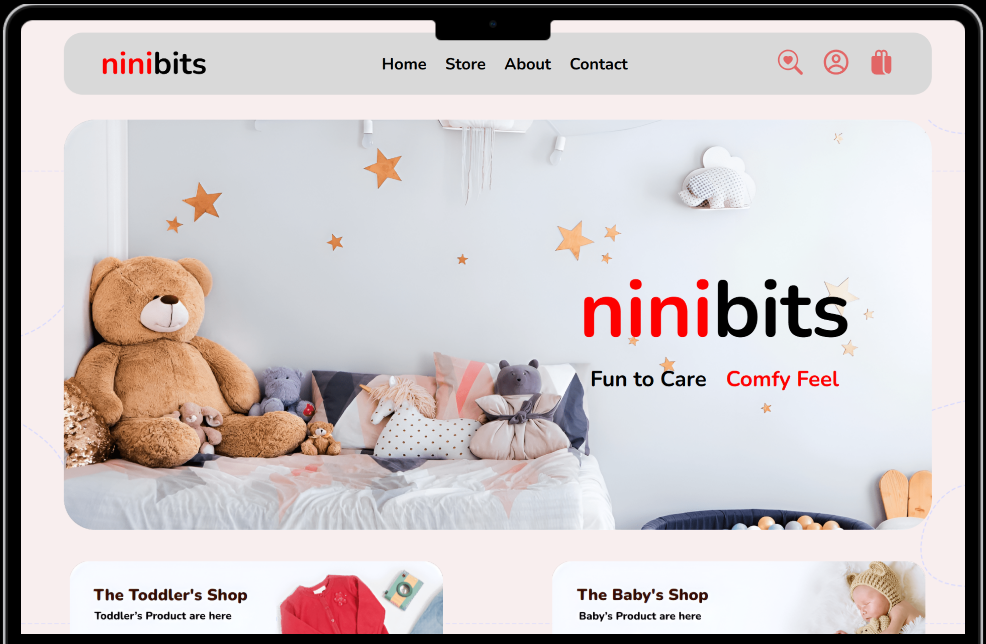

# niniBits E-commerce Store

Welcome to **niniBits**, a modern, responsive e-commerce web application built with React, Vite, and Material UI. This project demonstrates advanced front-end development skills, clean architecture, and a focus on user experience.

## 🚀 Features

- **React + Vite**: Fast, modern development environment with hot module replacement.
- **Material UI**: Custom theming and responsive design for a polished, professional look.
- **Component-Based Architecture**: Reusable, well-structured components for maintainability.
- **React Router**: Seamless client-side navigation.
- **Context API**: Efficient global state management for cart and shop data.
- **Dynamic Product Pages**: Detailed product info, reviews, and photo galleries.
- **Checkout & Payment Flow**: User-friendly forms and order summary.
- **Custom Theming**: Unique color palette and typography for brand consistency.
- **Accessibility**: Semantic HTML and keyboard navigation support.
- **Performance Optimizations**: Lazy loading images and code splitting.

## 🛠️ Tech Stack

- [React](https://react.dev/)
- [Vite](https://vitejs.dev/)
- [Material UI](https://mui.com/)
- [React Router](https://reactrouter.com/)
- [ESLint](https://eslint.org/) & [Prettier](https://prettier.io/)

## 📁 Project Structure

```
src/
  assets/         # Images, icons, and static assets
  components/     # Reusable UI components (Navbar, Footer, ProductItem, etc.)
  context/        # React Context for global state
  pages/          # Main pages (Home, Store, About, Contact, Checkout, Payment)
  theme.js        # Custom Material UI theme
  App.jsx         # Main app component
  main.jsx        # Entry point
```

## 🧑‍💻 My Contributions & Skills Demonstrated

- **UI/UX Design**: Crafted a visually appealing and intuitive interface.
- **State Management**: Used React Context for scalable, maintainable state.
- **Reusable Components**: Built modular components for rapid development.
- **Responsive Design**: Ensured mobile-first, cross-device compatibility.
- **API Integration Ready**: Designed data structures for easy backend integration.
- **Code Quality**: Enforced with ESLint and Prettier.
- **Performance**: Optimized asset loading and minimized bundle size.
- **Accessibility**: Followed best practices for inclusive design.

## 📦 Getting Started

1. **Install dependencies:**
   ```sh
   npm install
   ```
2. **Run the development server:**
   ```sh
   npm run dev
   ```
3. **Build for production:**
   ```sh
   npm run build
   ```

## 📸 Screenshots




---

> **niniBits** – Developed with ❤️ by [Shima Safari]
